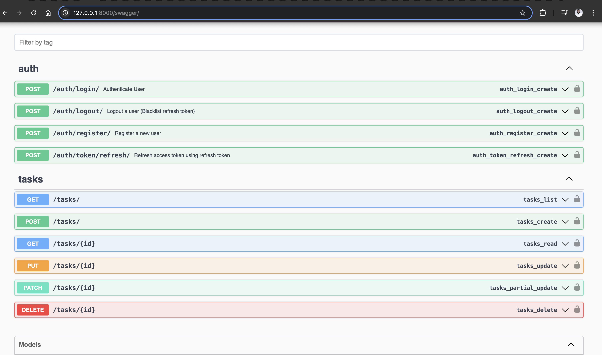

# 👋 About Me
I'm Olajide Ojo, a QA Engineer expanding into Backend Development. I focus on building practical, testable APIs and systems that power real-world workflows. Always learning, always improving.

# Task Management API – Built with Django Rest Framework

This project is a simple yet powerful backend API that allows users to manage tasks effectively. It supports user authentication, task creation, updates, and custom scheduling logic.

> 💡 Built as part of my transition into Backend Engineering, showcasing hands-on skills with Django, DRF, and API design.

## What's Included

This repo includes:

```
task-api-showcase/
├── README.md
├── assets/
│ └── swagger_preview.png # Swagger UI screenshot
├── code_samples/
│ ├── views.py # Core task views
│ ├── serializers.py # Validation & logic
│ └── urls.py # API routing
└── LICENSE.md
```
---

## 🚀 Key Features

- ✅ **JWT Auth** – Login, logout, refresh with token blacklisting
- ✅ **Task Management** – CRUD + toggle completion status
- ✅ **Date Guardrails** – Prevent past scheduling
- ✅ **Auto-Calculate Due Time** – Combines start time + duration
- ✅ **Swagger Docs** – Auto-generated API explorer
- ✅ **Clean Timestamps** – Consistent `YYYY-MM-DD HH:MM:SS`

---

## 📸 API Docs Preview




## Run the API Locally

```bash
git clone https://github.com/OlajideTechie/Task-Management.git
cd Task-Management
```


# Set up virtual environment
```python -m venv env
source env/bin/activate  # or env\Scripts\activate on Windows
```

# Install dependencies
```pip install -r requirements.txt```

# Run migrations and start server
```
python manage.py migrate
python manage.py runserver
```

# Access Swagger docs at
```
http://127.0.0.1:8000/docs/
```


# 🔑 Want Full Access?
This showcase highlights only selected logic. To access the full working repository:

✉️ Email me at oolajide91@gmail.com
Let’s connect on LinkedIn (https://www.linkedin.com/in/ojo-olajide/)